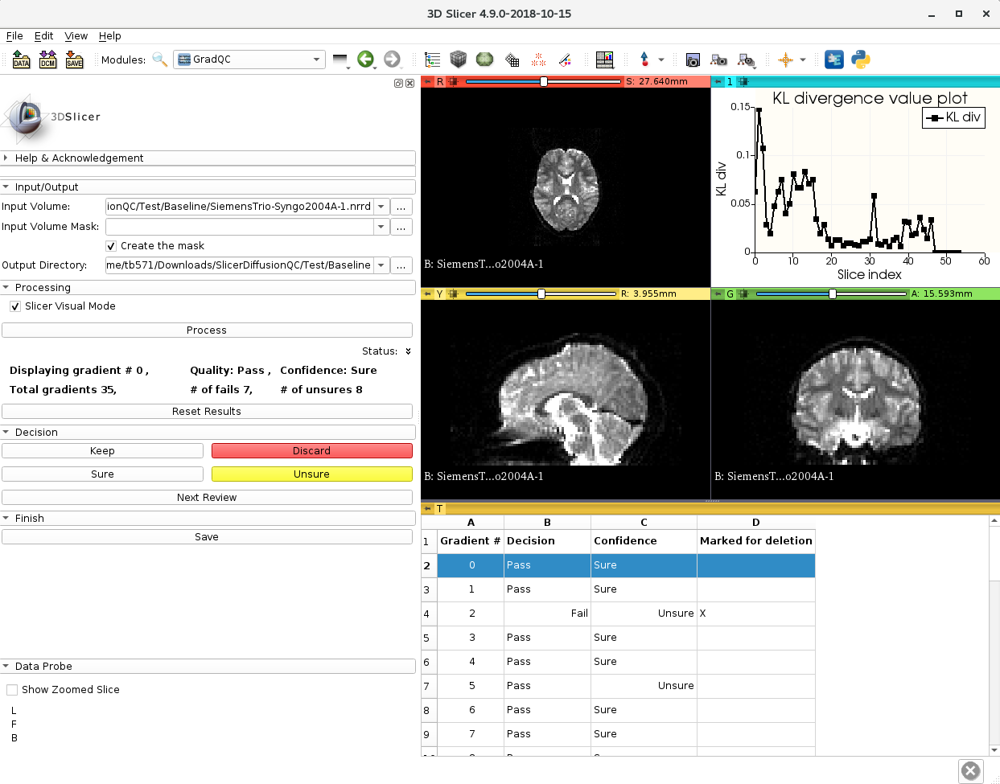

# SlicerDiffusionQC


This is a complete slicer module for quality checking of diffusion weighted MRI. It
identifies bad gradients by comparing distance of each gradient to a median line. The median line is obtained from
KL divergences between consecutive slices. After above processing, it allows user to manually
review each gradient: keep or discard them.

A similar software, based on MATLAB environment, was developed earlier by a group
of Yogesh Rathi, Asst. Professor, Harvard Medical School.
The MATLAB SignalDropQCTool is available at [](https://github.com/pnlbwh/SignalDropQCTool)
On the other hand, the SlicerDiffusionQC is a faster, cleaner, and more user oriented version of that software.

Developed by Tashrif Billah and Isaiah Norton, Brigham and Women's Hospital (Harvard Medical School).




# Citation

If you use our software in your research, please cite as below:

Tashrif Billah, Isaiah Norton, Yogesh Rathi, Sylvain Bouix, and Carquex Come, Slicer Diffusion QC Tool, https://github.com/pnlbwh/SlicerDiffusionQC, 2018, 
Psychiatry Neuroimaging Laboratory, Brigham and Women's Hospital and Harvard Medical School. 


# Installation

Download [Slicer-4.9](https://download.slicer.org/). Slicer Diffusion QC Tool is available as an extension to Slicer. From Extension Manager in Slicer, search `DiffusionQC` and install.


# Usage

path/to/slicer.exe --launch path/to/slicer/python-real /path/to/cli-modules/diffusionQC.py

```
Checks the quality of gradients in a diffusion weighted mri.
Predicts each gradient as pass or fail.

Usage:
    diffusionQC.py [SWITCHES] 

Meta-switches:
    -h, --help                          Prints this help message and quits
    --help-all                          Prints help messages of all sub-commands and quits
    -v, --version                       Prints the program's version and quits

Switches:
    -a, --auto                          Turn on this flag for command line/automatic processing w/o Slicer
                                        visualization
    -i, --input VALUE:ExistingFile      diffusion weighted mri e.g. dwi.nrrd or path/to/dwi.nrrd, accepted formats:
                                        nhdr, nrrd, nii, and nii.gz; required
    -m, --mask VALUE:ExistingFile       mask for the diffusion weighted mri, e.g. mask.nrrd or path/to/mask.nrrd,
                                        accepted formats: nhdr, nrrd, nii, and nii.gz, if not provided then looks for
                                        default: dwi_mask.format in input directory, if default is not available,
                                        then creates the mask
    -o, --out VALUE:str                 output directory (default: input dwi directory)


```


# Testing installation


i) Download the [sample](https://github.com/pnlbwh/SlicerDiffusionQC/blob/master/Test/Baseline/SiemensTrio-Syngo2004A-1.nrrd) dwi image. 
Type `GradQC` in `Slicer>Modules` search icon, and select it from the drop down menu. Load the sample dwi, check `Create the mask` and hit `Process`. 
If the process completes without any error, installation is successfull. You can observe the output files in sample dwi image directory.


ii) From the command line, you can test as follows:

```
path/to/slicer.exe --launch path/to/slicer/python-real /path/to/cli-modules/diffusionQC.py -i sample/dwi/image.nrrd -a

```

ii) (Optional) You can clone the repository and run test as follows:


```
git clone https://github.com/pnlbwh/SlicerDiffusionQC.git
cd SlicerDiffusionQC
path/to/slicer.exe --launch path/to/slicer/python-real Test/run_test.py

```

`SlicerDiffusionQC/Test/Baseline` contains reference results.
If installation is successful, the above command will create some files in a temporary directory.
Follow STDOUT to see success.

*You need to have `git lfs` set up on your machine:

[Download](https://git-lfs.github.com/) Git command line extension

```
tar -xzvf git-lfs-linux-*
install.sh
git lfs install

```


# For automatic processing:

The following are example command line calls:


i) If you do not have a mask and you want the pipeline to create one, do not specify the `-m/--mask` flag.


ii) When you don't have a mask, and you are okay with saving results in the input directory:

`path/to/slicer.exe --launch path/to/slicer/python-real /path/to/cli-modules/diffusionQC.py -i path/to/input.nrrd -a`


iii) When you have a mask, and you are okay with saving results in the input directory:

`path/to/slicer.exe --launch path/to/slicer/python-real /path/to/cli-modules/diffusionQC.py -i path/to/input.nrrd -m path/to/mask.nrrd -a`


iv) When you want to specify an output diretory:

`path/to/slicer.exe --launch path/to/slicer/python-real /path/to/cli-modules/diffusionQC.py -i path/to/input.nrrd -m path/to/mask.nrrd -o output/directory -a`


The above command line calls save temporary `.npy` files and final results- `inputPrefix_modified.nrrd` and `inputPrefix_QC.csv`.


# For Slicer GUI manual processing:

1. Type `GradQC` in `Slicer>Modules` search icon, and select it from the drop down menu.


2. Specify the input image, input mask, and output directory. Hit `Process`. Based on the power of your machine, it might take a few minutes to see the results on Slicer. The rest should be interactive.


The CLI wrapper makes following command line calls and creates temporary files as explained below:

```
path/to/slicer.exe --launch path/to/slicer/python-real /path/to/cli-modules/diffusionQC.py -i path/to/input.nrrd -m path/to/mask.nrrd
path/to/slicer.exe --launch path/to/slicer/python-real /path/to/cli-modules/diffusionQC.py -i path/to/input.nrrd -m path/to/mask.nrrd -o output/directory

```

Saves `inputPrefix_QC.npy, inputPrefix_confidence.npy, and inputPrefix_KLdiv.npy`. The temporary files are loaded in
[Slicer GUI](GradQC). After user interaction, when `Save`
is selected, the results are saved as `inputPrefix_modified.nrrd` and `inputPrefix_QC.csv`.


If mask is not available, keep the `Input Volume Mask` field empty and check `Create the mask`. Then, `inputPrefix_bse.nrrd` and `inputPrefix_mask.nrrd` are created.


The following are run modes from [GUI](GradQC/GradQC.py):

i) `Slicer Visual Mode` (checked) and result files exist: does not do [gradient processing](cli-modules/diffusionQC/qclib/gradient_process.py) again.
Uses existing result files to display on Slicer, waits for user interaction and `Save`.

ii) `Slicer Visual Mode` (checked) and result files do not exist: runs the whole program, uses created result files to display on Slicer, waits for user interaction and `Save`.

iii) `Slicer Visual Mode` (unchecked): irrespective of result files' existence, triggers automode and runs the [gradient processing](cli-modules/diffusionQC/qclib/gradient_process.py) again.
Since autoMode is triggered, Slicer GUI interaction does not open.


# File description

Clone the repository `git clone https://github.com/pnlbwh/SlicerDiffusionQC.git` in your local directory.


[diffusionQC.py](diffusionQC/diffusionQC.py) is the cli-module that can be run from the command line. On the other hand, [GradQC.py](GradQC/GradQC.py) is the GUI module that is loaded into Slicer.


The [SlicerExecutionModel wrapper](diffusionQC/diffusionQC.xml) describes the input/output of this script for use by Slicer. The Slicer scripted GUI module code is within the SlicerDiffusionQC subdirectory.


